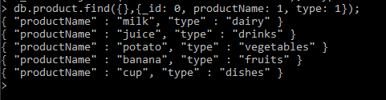
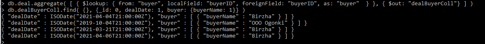
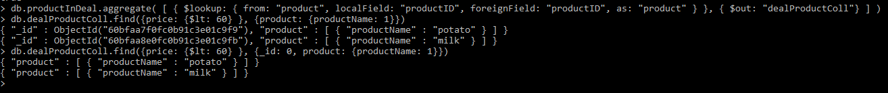
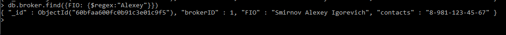

# Queries

#### 1) Выдать все продукты с их типами
```
db.product.find({},{_id: 0, productName: 1, type: 1});
```

#### 2) Выдать покупателей для каждой сделки
```
db.deal.aggregate( [ { $lookup: { from: "buyer", localField: "buyerID", foreignField: "buyerID", as: "buyer"  } }, { $out: "dealBuyerColl"} ] )
db.dealBuyerColl.find( {}, {_id: 0, dealDate: 1, buyer: {buyerName: 1}} )
```

#### 3) Выдать названия продуктов, цена которых меньше 60
```
db.productInDeal.aggregate( [ { $lookup: { from: "product", localField: "productID", foreignField: "productID", as: "product" } }, { $out: "dealProductColl"} ] )
db.dealProductColl.find({price: {$lt: 60} }, {_id: 0, product: {productName: 1}})
```

#### 4) Выдать всех брокеров с именем Алексей 
(В БД нет отдельного поля для имени, только ФИО целиком)
```
db.broker.find({FIO: {$regex:"Alexey"}})
```

#### 5) Выдать названия товаров, производящихся фирмой "South"
```
db.productInDeal.aggregate( [ { $lookup: { from: "product", localField: "productID", foreignField: "productID", as: "product" } }, { $out: "dealProductColl"} ] )
db.firm.aggregate( [ { $lookup: { from: "dealProductColl", localField: "firmID", foreignField: "firmID", as: "dealProductColl" } }, { $out: "firmProductColl"} ] )
db.firmProductColl.find(firmName: "South"}, {_id: 0, dealProductColl: { product: {productName: 1} } })
```
